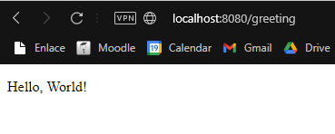
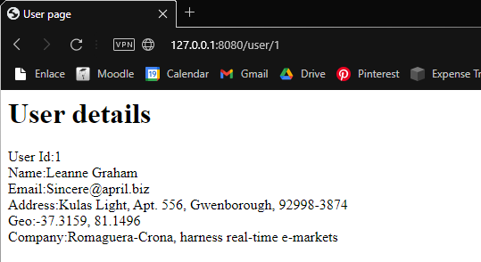
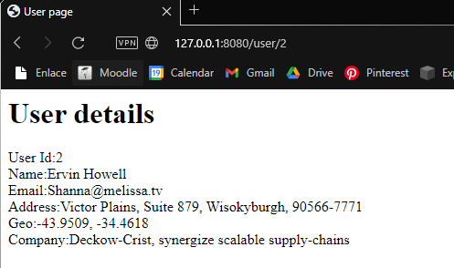
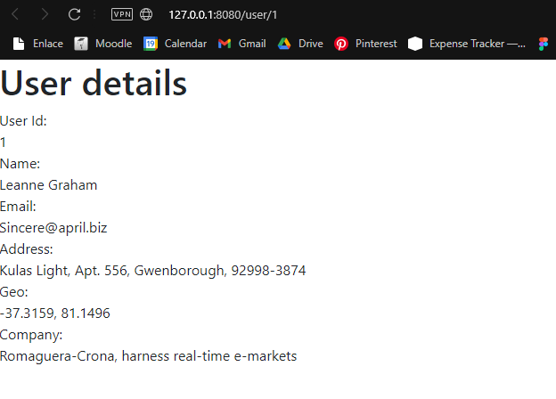
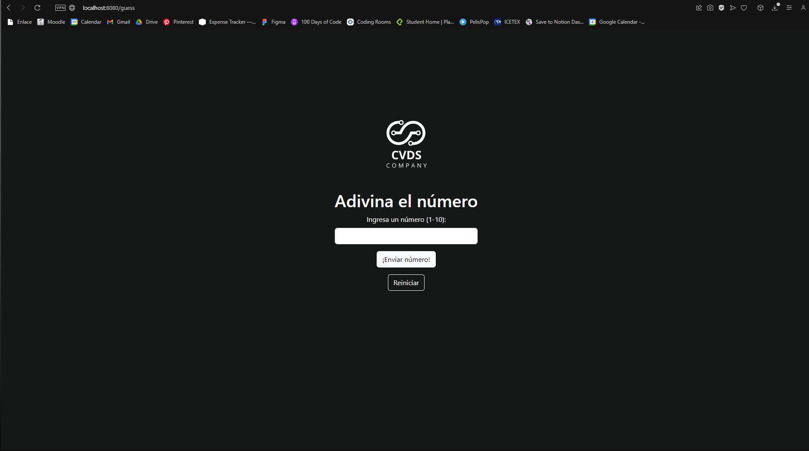
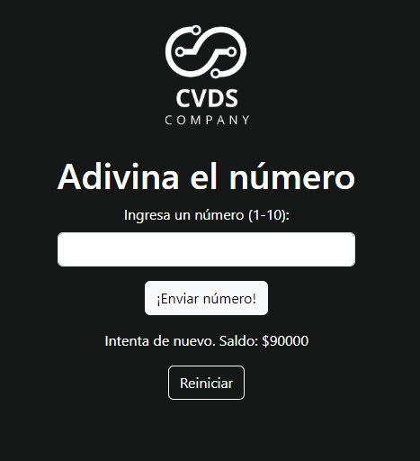
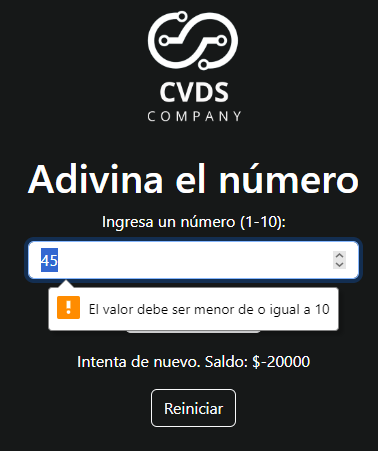

# CVDS_Lab5
## Integrantes
* Juan David Contreras Becerra
* Ana Maria Duran Burgos
* Johan Alejandro Estrada

## Parte I - JUGANDO A SER UN CLIENTE HTTP

### Solución
* ¿Qué codigo de error sale?, revise el significado del mismo en la lista de códigos de estado HTTP.
  * El codigo de error que se tiene como respuesta es 301. Este codigo indica que el recurso fue movido a otro lugar, la peticion debe ser relizada a la nueva dirección.
```
Trying 54.237.133.81...
Connected to stark-cherimoya-jg38tzhyu4qth9c744i6vz0y.herokudns.com.
Escape character is '^]'.
GET /sssss/abc.html HTTP/1.0
Host: www.escuelaing.edu.co

HTTP/1.1 301 Moved Permanently
Report-To: {"group":"heroku-nel","max_age":3600,"endpoints":[{"url":"https://nel.heroku.com/reports?ts=1708641472&sid=1b10b0ff-8a76-4548-befa-353fc6c6c045&s=MAHUW53q8ZjhMc%2BI1uquOBT%2BFOJKzgeVPJQyNixLNIg%3D"}]}
Reporting-Endpoints: heroku-nel=https://nel.heroku.com/reports?ts=1708641472&sid=1b10b0ff-8a76-4548-befa-353fc6c6c045&s=MAHUW53q8ZjhMc%2BI1uquOBT%2BFOJKzgeVPJQyNixLNIg%3D
Nel: {"report_to":"heroku-nel","max_age":3600,"success_fraction":0.005,"failure_fraction":0.05,"response_headers":["Via"]}
Connection: close
Server: gunicorn
Date: Thu, 22 Feb 2024 22:37:52 GMT
Content-Type: text/html; charset=utf-8
Location: https://www.escuelaing.edu.co/sssss/abc.html
X-Content-Type-Options: nosniff
Referrer-Policy: same-origin
Cross-Origin-Opener-Policy: same-origin
Via: 1.1 vegur

Connection closed by foreign host.

```

* ¿Qué otros códigos de error existen?, ¿En qué caso se manejarán?
   *  Los codigos de error corresponden a los 400 y 500, los 300 son codigos de redirección.
      *  400: Bad Request
      *  401: Unauthorized
      *  403: Forbidden
      *  404: Not Found
      *  405: Method Not Allowed
      *  408: Request Timeout
      *  409: Conflict
      *  410: Gone
      *  429: Too Many Requests
      *  500: Internal Server Error
      *  501: Not Implemented
      *  502: Bad Gateway
      *  503: Service Unavailable
      *  504: Gateway Timeout
      *  505: HTTP Version Not Supported
   *  En los codigos de redirección tenemos:
      *  300: Multiple Choices
      *  301: Moved Permanently
      *  302: Found
      *  304: Not Modified
      *  307: Temporary Redirect
      *  308: Permanent Redirect
* Resultado:
<!DOCTYPE html>
<html>
  <head>
  </head>
  <body>
    <h1>Herman Melville - Moby-Dick</h1>
    <div>
      <p>
        Availing himself of the mild, summer-cool weather that now reigned in these latitudes, and in preparation for the peculiarly active pursuits shortly to be anticipated, Perth, the begrimed, blistered old blacksmith, had not removed his portable forge to the hold again, after concluding his contributory work for Ahab's leg, but still retained it on deck, fast lashed to ringbolts by the foremast; being now almost incessantly invoked by the headsmen, and harpooneers, and bowsmen to do some little job for them; altering, or repairing, or new shaping their various weapons and boat furniture. Often he would be surrounded by an eager circle, all waiting to be served; holding boat-spades, pike-heads, harpoons, and lances, and jealously watching his every sooty movement, as he toiled. Nevertheless, this old man's was a patient hammer wielded by a patient arm. No murmur, no impatience, no petulance did come from him. Silent, slow, and solemn; bowing over still further his chronically broken back, he toiled away, as if toil were life itself, and the heavy beating of his hammer the heavy beating of his heart. And so it was.—Most miserable! A peculiar walk in this old man, a certain slight but painful appearing yawing in his gait, had at an early period of the voyage excited the curiosity of the mariners. And to the importunity of their persisted questionings he had finally given in; and so it came to pass that every one now knew the shameful story of his wretched fate. Belated, and not innocently, one bitter winter's midnight, on the road running between two country towns, the blacksmith half-stupidly felt the deadly numbness stealing over him, and sought refuge in a leaning, dilapidated barn. The issue was, the loss of the extremities of both feet. Out of this revelation, part by part, at last came out the four acts of the gladness, and the one long, and as yet uncatastrophied fifth act of the grief of his life's drama. He was an old man, who, at the age of nearly sixty, had postponedly encountered that thing in sorrow's technicals called ruin. He had been an artisan of famed excellence, and with plenty to do; owned a house and garden; embraced a youthful, daughter-like, loving wife, and three blithe, ruddy children; every Sunday went to a cheerful-looking church, planted in a grove. But one night, under cover of darkness, and further concealed in a most cunning disguisement, a desperate burglar slid into his happy home, and robbed them all of everything. And darker yet to tell, the blacksmith himself did ignorantly conduct this burglar into his family's heart. It was the Bottle Conjuror! Upon the opening of that fatal cork, forth flew the fiend, and shrivelled up his home. Now, for prudent, most wise, and economic reasons, the blacksmith's shop was in the basement of his dwelling, but with a separate entrance to it; so that always had the young and loving healthy wife listened with no unhappy nervousness, but with vigorous pleasure, to the stout ringing of her young-armed old husband's hammer; whose reverberations, muffled by passing through the floors and walls, came up to her, not unsweetly, in her nursery; and so, to stout Labor's iron lullaby, the blacksmith's infants were rocked to slumber. Oh, woe on woe! Oh, Death, why canst thou not sometimes be timely? Hadst thou taken this old blacksmith to thyself ere his full ruin came upon him, then had the young widow had a delicious grief, and her orphans a truly venerable, legendary sire to dream of in their after years; and all of them a care-killing competency.
      </p>
    </div>
  </body>
</html>

* Codigo

```

Trying 35.171.123.176...
Connected to www.httpbin.org.
Escape character is '^]'.
GET /html HTTP/1.1
Host: www.httpbin.org

HTTP/1.1 200 OK
Date: Thu, 22 Feb 2024 22:49:04 GMT
Content-Type: text/html; charset=utf-8
Content-Length: 3741
Connection: keep-alive
Server: gunicorn/19.9.0
Access-Control-Allow-Origin: *
Access-Control-Allow-Credentials: true


<!DOCTYPE html>
<html>
  <head>
  </head>
  <body>
      <h1>Herman Melville - Moby-Dick</h1>

      <div>
        <p>
          Availing himself of the mild, summer-cool weather that now reigned in these latitudes, and in preparation for the peculiarly active pursuits shortly to be anticipated, Perth, the begrimed, blistered old blacksmith, had not removed his portable forge to the hold again, after concluding his contributory work for Ahab's leg, but still retained it on deck, fast lashed to ringbolts by the foremast; being now almost incessantly invoked by the headsmen, and harpooneers, and bowsmen to do some little job for them; altering, or repairing, or new shaping their various weapons and boat furniture. Often he would be surrounded by an eager circle, all waiting to be served; holding boat-spades, pike-heads, harpoons, and lances, and jealously watching his every sooty movement, as he toiled. Nevertheless, this old man's was a patient hammer wielded by a patient arm. No murmur, no impatience, no petulance did come from him. Silent, slow, and solemn; bowing over still further his chronically broken back, he toiled away, as if toil were life itself, and the heavy beating of his hammer the heavy beating of his heart. And so it was.—Most miserable! A peculiar walk in this old man, a certain slight but painful appearing yawing in his gait, had at an early period of the voyage excited the curiosity of the mariners. And to the importunity of their persisted questionings he had finally given in; and so it came to pass that every one now knew the shameful story of his wretched fate. Belated, and not innocently, one bitter winter's midnight, on the road running between two country towns, the blacksmith half-stupidly felt the deadly numbness stealing over him, and sought refuge in a leaning, dilapidated barn. The issue was, the loss of the extremities of both feet. Out of this revelation, part by part, at last came out the four acts of the gladness, and the one long, and as yet uncatastrophied fifth act of the grief of his life's drama. He was an old man, who, at the age of nearly sixty, had postponedly encountered that thing in sorrow's technicals called ruin. He had been an artisan of famed excellence, and with plenty to do; owned a house and garden; embraced a youthful, daughter-like, loving wife, and three blithe, ruddy children; every Sunday went to a cheerful-looking church, planted in a grove. But one night, under cover of darkness, and further concealed in a most cunning disguisement, a desperate burglar slid into his happy home, and robbed them all of everything. And darker yet to tell, the blacksmith himself did ignorantly conduct this burglar into his family's heart. It was the Bottle Conjuror! Upon the opening of that fatal cork, forth flew the fiend, and shrivelled up his home. Now, for prudent, most wise, and economic reasons, the blacksmith's shop was in the basement of his dwelling, but with a separate entrance to it; so that always had the young and loving healthy wife listened with no unhappy nervousness, but with vigorous pleasure, to the stout ringing of her young-armed old husband's hammer; whose reverberations, muffled by passing through the floors and walls, came up to her, not unsweetly, in her nursery; and so, to stout Labor's iron lullaby, the blacksmith's infants were rocked to slumber. Oh, woe on woe! Oh, Death, why canst thou not sometimes be timely? Hadst thou taken this old blacksmith to thyself ere his full ruin came upon him, then had the young widow had a delicious grief, and her orphans a truly venerable, legendary sire to dream of in their after years; and all of them a care-killing competency.
        </p>
      </div>
  </body>
</html>Connection closed by foreign host.
```
* La cantidad de caracteres de el resultado de la consulta es de 3570 caracteres
```
johan@johan-Victus-by-HP-Laptop-16-d0xxx:~$ wc -c
 Availing himself of the mild, summer-cool weather that now reigned in these latitudes, and in preparation for the peculiarly active pursuits shortly to be anticipated, Perth, the begrimed, blistered old blacksmith, had not removed his portable forge to the hold again, after concluding his contributory work for Ahab's leg, but still retained it on deck, fast lashed to ringbolts by the foremast; being now almost incessantly invoked by the headsmen, and harpooneers, and bowsmen to do some little job for them; altering, or repairing, or new shaping their various weapons and boat furniture. Often he would be surrounded by an eager circle, all waiting to be served; holding boat-spades, pike-heads, harpoons, and lances, and jealously watching his every sooty movement, as he toiled. Nevertheless, this old man's was a patient hammer wielded by a patient arm. No murmur, no impatience, no petulance did come from him. Silent, slow, and solemn; bowing over still further his chronically broken back, he toiled away, as if toil were life itself, and the heavy beating of his hammer the heavy beating of his heart. And so it was.—Most miserable! A peculiar walk in this old man, a certain slight but painful appearing yawing in his gait, had at an early period of the voyage excited the curiosity of the mariners. And to the importunity of their persisted questionings he had finally given in; and so it came to pass that every one now knew the shameful story of his wretched fate. Belated, and not innocently, one bitter winter's midnight, on the road running between two country towns, the blacksmith half-stupidly felt the deadly numbness stealing over him, and sought refuge in a leaning, dilapidated barn. The issue was, the loss of the extremities of both feet. Out of this revelation, part by part, at last came out the four acts of the gladness, and the one long, and as yet uncatastrophied fifth act of the grief of his life's drama. He was an old man, who, at the age of nearly sixty, had postponedly encountered that thing in sorrow's technicals called ruin. He had been an artisan of famed excellence, and with plenty to do; owned a house and garden; embraced a youthful, daughter-like, loving wife, and three blithe, ruddy children; every Sunday went to a cheerful-looking church, planted in a grove. But one night, under cover of darkness, and further concealed in a most cunning disguisement, a desperate burglar slid into his happy home, and robbed them all of everything. And darker yet to tell, the blacksmith himself did ignorantly conduct this burglar into his family's heart. It was the Bottle Conjuror! Upon the opening of that fatal cork, forth flew the fiend, and shrivelled up his home. Now, for prudent, most wise, and economic reasons, the blacksmith's shop was in the basement of his dwelling, but with a separate entrance to it; so that always had the young and loving healthy wife listened with no unhappy nervousness, but with vigorous pleasure, to the stout ringing of her young-armed old husband's hammer; whose reverberations, muffled by passing through the floors and walls, came up to her, not unsweetly, in her nursery; and so, to stout Labor's iron lullaby, the blacksmith's infants were rocked to slumber. Oh, woe on woe! Oh, Death, why canst thou not sometimes be timely? Hadst thou taken this old blacksmith to thyself ere his full ruin came upon him, then had the young widow had a delicious grief, and her orphans a truly venerable, legendary sire to dream of in their after years; and all of them a care-killing competency.
3570
```
* Claro está, las peticiones GET son insuficientes en muchos casos. Investigue: ¿Cuál esla diferencia entre los verbos GET y POST? ¿Qué otros tipos de peticiones existen?
   * Las solicitudes GET se usan para solicitar datos del servidor; las solicitudes post son usadas para enviar datos al servidor.
   * Los otros tipos de solicitudes que existen son:
      * HEAD: Se usa para solicitar los encabezados de respuesta.
      * PUT: Se usa para enviar datos al servidor para crear o actualizar un recurso en esa ubicación.
      * DELETE: Se usa para eliminar un recurso en especifico del servidor.
      * PATCH: Se usa para enviar datos al servidor de manera similar a la solicitud PUT, pero se usa para modificaciones parciales en lugar de reemplazar el archivo completo.
      * OPTIONS: Se usa para obtener informacion sobre los metodos HTTP admitidos por un servidor.
      * TRACE: Se usa para realizar un segumiento de la ruta de la solicitud desde el cliente hasta el servidor.
      * CONNECT: Se usa oara solicitar una conexión TCP/IP a un servidor proxy.
* Usando el comando curl tenemos como respuesta:

```
<!DOCTYPE html>
<html lang="en">

<head>
    <meta charset="UTF-8">
    <title>httpbin.org</title>
    <link href="https://fonts.googleapis.com/css?family=Open+Sans:400,700|Source+Code+Pro:300,600|Titillium+Web:400,600,700"
        rel="stylesheet">
    <link rel="stylesheet" type="text/css" href="/flasgger_static/swagger-ui.css">
    <link rel="icon" type="image/png" href="/static/favicon.ico" sizes="64x64 32x32 16x16" />
    <style>
        html {
            box-sizing: border-box;
            overflow: -moz-scrollbars-vertical;
            overflow-y: scroll;
        }

        *,
        *:before,
        *:after {
            box-sizing: inherit;
        }

        body {
            margin: 0;
            background: #fafafa;
        }
    </style>
</head>

<body>
    <a href="https://github.com/requests/httpbin" class="github-corner" aria-label="View source on Github">
        <svg width="80" height="80" viewBox="0 0 250 250" style="fill:#151513; color:#fff; position: absolute; top: 0; border: 0; right: 0;"
            aria-hidden="true">
            <path d="M0,0 L115,115 L130,115 L142,142 L250,250 L250,0 Z"></path>
            <path d="M128.3,109.0 C113.8,99.7 119.0,89.6 119.0,89.6 C122.0,82.7 120.5,78.6 120.5,78.6 C119.2,72.0 123.4,76.3 123.4,76.3 C127.3,80.9 125.5,87.3 125.5,87.3 C122.9,97.6 130.6,101.9 134.4,103.2"
                fill="currentColor" style="transform-origin: 130px 106px;" class="octo-arm"></path>
            <path d="M115.0,115.0 C114.9,115.1 118.7,116.5 119.8,115.4 L133.7,101.6 C136.9,99.2 139.9,98.4 142.2,98.6 C133.8,88.0 127.5,74.4 143.8,58.0 C148.5,53.4 154.0,51.2 159.7,51.0 C160.3,49.4 163.2,43.6 171.4,40.1 C171.4,40.1 176.1,42.5 178.8,56.2 C183.1,58.6 187.2,61.8 190.9,65.4 C194.5,69.0 197.7,73.2 200.1,77.6 C213.8,80.2 216.3,84.9 216.3,84.9 C212.7,93.1 206.9,96.0 205.4,96.6 C205.1,102.4 203.0,107.8 198.3,112.5 C181.9,128.9 168.3,122.5 157.7,114.1 C157.9,116.9 156.7,120.9 152.7,124.9 L141.0,136.5 C139.8,137.7 141.6,141.9 141.8,141.8 Z"
                fill="currentColor" class="octo-body"></path>
        </svg>
    </a>
    <svg xmlns="http://www.w3.org/2000/svg" xmlns:xlink="http://www.w3.org/1999/xlink" style="position:absolute;width:0;height:0">
        <defs>
            <symbol viewBox="0 0 20 20" id="unlocked">
                <path d="M15.8 8H14V5.6C14 2.703 12.665 1 10 1 7.334 1 6 2.703 6 5.6V6h2v-.801C8 3.754 8.797 3 10 3c1.203 0 2 .754 2 2.199V8H4c-.553 0-1 .646-1 1.199V17c0 .549.428 1.139.951 1.307l1.197.387C5.672 18.861 6.55 19 7.1 19h5.8c.549 0 1.428-.139 1.951-.307l1.196-.387c.524-.167.953-.757.953-1.306V9.199C17 8.646 16.352 8 15.8 8z"></path>
            </symbol>

            <symbol viewBox="0 0 20 20" id="locked">
                <path d="M15.8 8H14V5.6C14 2.703 12.665 1 10 1 7.334 1 6 2.703 6 5.6V8H4c-.553 0-1 .646-1 1.199V17c0 .549.428 1.139.951 1.307l1.197.387C5.672 18.861 6.55 19 7.1 19h5.8c.549 0 1.428-.139 1.951-.307l1.196-.387c.524-.167.953-.757.953-1.306V9.199C17 8.646 16.352 8 15.8 8zM12 8H8V5.199C8 3.754 8.797 3 10 3c1.203 0 2 .754 2 2.199V8z"
                />
            </symbol>

            <symbol viewBox="0 0 20 20" id="close">
                <path d="M14.348 14.849c-.469.469-1.229.469-1.697 0L10 11.819l-2.651 3.029c-.469.469-1.229.469-1.697 0-.469-.469-.469-1.229 0-1.697l2.758-3.15-2.759-3.152c-.469-.469-.469-1.228 0-1.697.469-.469 1.228-.469 1.697 0L10 8.183l2.651-3.031c.469-.469 1.228-.469 1.697 0 .469.469.469 1.229 0 1.697l-2.758 3.152 2.758 3.15c.469.469.469 1.229 0 1.698z"
                />
            </symbol>

            <symbol viewBox="0 0 20 20" id="large-arrow">
                <path d="M13.25 10L6.109 2.58c-.268-.27-.268-.707 0-.979.268-.27.701-.27.969 0l7.83 7.908c.268.271.268.709 0 .979l-7.83 7.908c-.268.271-.701.27-.969 0-.268-.269-.268-.707 0-.979L13.25 10z"
                />
            </symbol>

            <symbol viewBox="0 0 20 20" id="large-arrow-down">
                <path d="M17.418 6.109c.272-.268.709-.268.979 0s.271.701 0 .969l-7.908 7.83c-.27.268-.707.268-.979 0l-7.908-7.83c-.27-.268-.27-.701 0-.969.271-.268.709-.268.979 0L10 13.25l7.418-7.141z"
                />
            </symbol>


            <symbol viewBox="0 0 24 24" id="jump-to">
                <path d="M19 7v4H5.83l3.58-3.59L8 6l-6 6 6 6 1.41-1.41L5.83 13H21V7z" />
            </symbol>

            <symbol viewBox="0 0 24 24" id="expand">
                <path d="M10 18h4v-2h-4v2zM3 6v2h18V6H3zm3 7h12v-2H6v2z" />
            </symbol>

        </defs>
    </svg>


    <div id="swagger-ui">
        <div data-reactroot="" class="swagger-ui">
            <div>
                <div class="information-container wrapper">
                    <section class="block col-12">
                        <div class="info">
                            <hgroup class="main">
                                <h2 class="title">httpbin.org
                                    <small>
                                        <pre class="version">0.9.2</pre>
                                    </small>
                                </h2>
                                <pre class="base-url">[ Base URL: httpbin.org/ ]</pre>
                            </hgroup>
                            <div class="description">
                                <div class="markdown">
                                    <p>A simple HTTP Request &amp; Response Service.
                                        <br>
                                        <br>
                                        <b>Run locally: </b>
                                        <code>$ docker run -p 80:80 kennethreitz/httpbin</code>
                                    </p>
                                </div>
                            </div>
                            <div>
                                <div>
                                    <a href="https://kennethreitz.org" target="_blank">the developer - Website</a>
                                </div>
                                <a href="mailto:me@kennethreitz.org">Send email to the developer</a>
                            </div>
                        </div>
                        <!-- ADDS THE LOADER SPINNER -->
                        <div class="loading-container">
                            <div class="loading"></div>
                        </div>

                    </section>
                </div>
            </div>
        </div>
    </div>


    <div class='swagger-ui'>
        <div class="wrapper">
            <section class="clear">
                <span style="float: right;">
                    [Powered by
                    <a target="_blank" href="https://github.com/rochacbruno/flasgger">Flasgger</a>]
                    <br>
                </span>
            </section>
        </div>
    </div>


    <script src="/flasgger_static/swagger-ui-bundle.js"> </script>
    <script src="/flasgger_static/swagger-ui-standalone-preset.js"> </script>
    <script src='/flasgger_static/lib/jquery.min.js' type='text/javascript'></script>
    <script>

        window.onload = function () {
            

            fetch("/spec.json")
                .then(function (response) {
                    response.json()
                        .then(function (json) {
                            var current_protocol = window.location.protocol.slice(0, -1);
                            if (json.schemes[0] != current_protocol) {
                                // Switches scheme to the current in use
                                var other_protocol = json.schemes[0];
                                json.schemes[0] = current_protocol;
                                json.schemes[1] = other_protocol;

                            }
                            json.host = window.location.host;  // sets the current host

                            const ui = SwaggerUIBundle({
                                spec: json,
                                validatorUrl: null,
                                dom_id: '#swagger-ui',
                                deepLinking: true,
                                jsonEditor: true,
                                docExpansion: "none",
                                apisSorter: "alpha",
                                //operationsSorter: "alpha",
                                presets: [
                                    SwaggerUIBundle.presets.apis,
                                    // yay ES6 modules ↘
                                    Array.isArray(SwaggerUIStandalonePreset) ? SwaggerUIStandalonePreset : SwaggerUIStandalonePreset.default
                                ],
                                plugins: [
                                    SwaggerUIBundle.plugins.DownloadUrl
                                ],
            
            // layout: "StandaloneLayout"  // uncomment to enable the green top header
        })

        window.ui = ui

        // uncomment to rename the top brand if layout is enabled
        // $(".topbar-wrapper .link span").replaceWith("<span>httpbin</span>");
        })
    })
}
    </script>  <div class='swagger-ui'>
    <div class="wrapper">
        <section class="block col-12 block-desktop col-12-desktop">
            <div>

                <h2>Other Utilities</h2>

                <ul>
                    <li>
                        <a href="/forms/post">HTML form</a> that posts to /post /forms/post</li>
                </ul>

                <br />
                <br />
            </div>
        </section>
    </div>
</div>
</body>

</html>
```
* Usando el parametro -v

```
*   Trying 3.221.184.26:80...
* Connected to www.httpbin.org (3.221.184.26) port 80 (#0)
> GET / HTTP/1.1
> Host: www.httpbin.org
> User-Agent: curl/8.1.2
> Accept: */*
> 
< HTTP/1.1 200 OK
< Date: Thu, 22 Feb 2024 23:28:12 GMT
< Content-Type: text/html; charset=utf-8
< Content-Length: 9593
< Connection: keep-alive
< Server: gunicorn/19.9.0
< Access-Control-Allow-Origin: *
< Access-Control-Allow-Credentials: true
< 
<!DOCTYPE html>
<html lang="en">

<head>
    <meta charset="UTF-8">
    <title>httpbin.org</title>
    <link href="https://fonts.googleapis.com/css?family=Open+Sans:400,700|Source+Code+Pro:300,600|Titillium+Web:400,600,700"
        rel="stylesheet">
    <link rel="stylesheet" type="text/css" href="/flasgger_static/swagger-ui.css">
    <link rel="icon" type="image/png" href="/static/favicon.ico" sizes="64x64 32x32 16x16" />
    <style>
        html {
            box-sizing: border-box;
            overflow: -moz-scrollbars-vertical;
            overflow-y: scroll;
        }

        *,
        *:before,
        *:after {
            box-sizing: inherit;
        }

        body {
            margin: 0;
            background: #fafafa;
        }
    </style>
</head>

<body>
    <a href="https://github.com/requests/httpbin" class="github-corner" aria-label="View source on Github">
        <svg width="80" height="80" viewBox="0 0 250 250" style="fill:#151513; color:#fff; position: absolute; top: 0; border: 0; right: 0;"
            aria-hidden="true">
            <path d="M0,0 L115,115 L130,115 L142,142 L250,250 L250,0 Z"></path>
            <path d="M128.3,109.0 C113.8,99.7 119.0,89.6 119.0,89.6 C122.0,82.7 120.5,78.6 120.5,78.6 C119.2,72.0 123.4,76.3 123.4,76.3 C127.3,80.9 125.5,87.3 125.5,87.3 C122.9,97.6 130.6,101.9 134.4,103.2"
                fill="currentColor" style="transform-origin: 130px 106px;" class="octo-arm"></path>
            <path d="M115.0,115.0 C114.9,115.1 118.7,116.5 119.8,115.4 L133.7,101.6 C136.9,99.2 139.9,98.4 142.2,98.6 C133.8,88.0 127.5,74.4 143.8,58.0 C148.5,53.4 154.0,51.2 159.7,51.0 C160.3,49.4 163.2,43.6 171.4,40.1 C171.4,40.1 176.1,42.5 178.8,56.2 C183.1,58.6 187.2,61.8 190.9,65.4 C194.5,69.0 197.7,73.2 200.1,77.6 C213.8,80.2 216.3,84.9 216.3,84.9 C212.7,93.1 206.9,96.0 205.4,96.6 C205.1,102.4 203.0,107.8 198.3,112.5 C181.9,128.9 168.3,122.5 157.7,114.1 C157.9,116.9 156.7,120.9 152.7,124.9 L141.0,136.5 C139.8,137.7 141.6,141.9 141.8,141.8 Z"
                fill="currentColor" class="octo-body"></path>
        </svg>
    </a>
    <svg xmlns="http://www.w3.org/2000/svg" xmlns:xlink="http://www.w3.org/1999/xlink" style="position:absolute;width:0;height:0">
        <defs>
            <symbol viewBox="0 0 20 20" id="unlocked">
                <path d="M15.8 8H14V5.6C14 2.703 12.665 1 10 1 7.334 1 6 2.703 6 5.6V6h2v-.801C8 3.754 8.797 3 10 3c1.203 0 2 .754 2 2.199V8H4c-.553 0-1 .646-1 1.199V17c0 .549.428 1.139.951 1.307l1.197.387C5.672 18.861 6.55 19 7.1 19h5.8c.549 0 1.428-.139 1.951-.307l1.196-.387c.524-.167.953-.757.953-1.306V9.199C17 8.646 16.352 8 15.8 8z"></path>
            </symbol>

            <symbol viewBox="0 0 20 20" id="locked">
                <path d="M15.8 8H14V5.6C14 2.703 12.665 1 10 1 7.334 1 6 2.703 6 5.6V8H4c-.553 0-1 .646-1 1.199V17c0 .549.428 1.139.951 1.307l1.197.387C5.672 18.861 6.55 19 7.1 19h5.8c.549 0 1.428-.139 1.951-.307l1.196-.387c.524-.167.953-.757.953-1.306V9.199C17 8.646 16.352 8 15.8 8zM12 8H8V5.199C8 3.754 8.797 3 10 3c1.203 0 2 .754 2 2.199V8z"
                />
            </symbol>

            <symbol viewBox="0 0 20 20" id="close">
                <path d="M14.348 14.849c-.469.469-1.229.469-1.697 0L10 11.819l-2.651 3.029c-.469.469-1.229.469-1.697 0-.469-.469-.469-1.229 0-1.697l2.758-3.15-2.759-3.152c-.469-.469-.469-1.228 0-1.697.469-.469 1.228-.469 1.697 0L10 8.183l2.651-3.031c.469-.469 1.228-.469 1.697 0 .469.469.469 1.229 0 1.697l-2.758 3.152 2.758 3.15c.469.469.469 1.229 0 1.698z"
                />
            </symbol>

            <symbol viewBox="0 0 20 20" id="large-arrow">
                <path d="M13.25 10L6.109 2.58c-.268-.27-.268-.707 0-.979.268-.27.701-.27.969 0l7.83 7.908c.268.271.268.709 0 .979l-7.83 7.908c-.268.271-.701.27-.969 0-.268-.269-.268-.707 0-.979L13.25 10z"
                />
            </symbol>

            <symbol viewBox="0 0 20 20" id="large-arrow-down">
                <path d="M17.418 6.109c.272-.268.709-.268.979 0s.271.701 0 .969l-7.908 7.83c-.27.268-.707.268-.979 0l-7.908-7.83c-.27-.268-.27-.701 0-.969.271-.268.709-.268.979 0L10 13.25l7.418-7.141z"
                />
            </symbol>


            <symbol viewBox="0 0 24 24" id="jump-to">
                <path d="M19 7v4H5.83l3.58-3.59L8 6l-6 6 6 6 1.41-1.41L5.83 13H21V7z" />
            </symbol>

            <symbol viewBox="0 0 24 24" id="expand">
                <path d="M10 18h4v-2h-4v2zM3 6v2h18V6H3zm3 7h12v-2H6v2z" />
            </symbol>

        </defs>
    </svg>


    <div id="swagger-ui">
        <div data-reactroot="" class="swagger-ui">
            <div>
                <div class="information-container wrapper">
                    <section class="block col-12">
                        <div class="info">
                            <hgroup class="main">
                                <h2 class="title">httpbin.org
                                    <small>
                                        <pre class="version">0.9.2</pre>
                                    </small>
                                </h2>
                                <pre class="base-url">[ Base URL: httpbin.org/ ]</pre>
                            </hgroup>
                            <div class="description">
                                <div class="markdown">
                                    <p>A simple HTTP Request &amp; Response Service.
                                        <br>
                                        <br>
                                        <b>Run locally: </b>
                                        <code>$ docker run -p 80:80 kennethreitz/httpbin</code>
                                    </p>
                                </div>
                            </div>
                            <div>
                                <div>
                                    <a href="https://kennethreitz.org" target="_blank">the developer - Website</a>
                                </div>
                                <a href="mailto:me@kennethreitz.org">Send email to the developer</a>
                            </div>
                        </div>
                        <!-- ADDS THE LOADER SPINNER -->
                        <div class="loading-container">
                            <div class="loading"></div>
                        </div>

                    </section>
                </div>
            </div>
        </div>
    </div>


    <div class='swagger-ui'>
        <div class="wrapper">
            <section class="clear">
                <span style="float: right;">
                    [Powered by
                    <a target="_blank" href="https://github.com/rochacbruno/flasgger">Flasgger</a>]
                    <br>
                </span>
            </section>
        </div>
    </div>


    <script src="/flasgger_static/swagger-ui-bundle.js"> </script>
    <script src="/flasgger_static/swagger-ui-standalone-preset.js"> </script>
    <script src='/flasgger_static/lib/jquery.min.js' type='text/javascript'></script>
    <script>

        window.onload = function () {
            

            fetch("/spec.json")
                .then(function (response) {
                    response.json()
                        .then(function (json) {
                            var current_protocol = window.location.protocol.slice(0, -1);
                            if (json.schemes[0] != current_protocol) {
                                // Switches scheme to the current in use
                                var other_protocol = json.schemes[0];
                                json.schemes[0] = current_protocol;
                                json.schemes[1] = other_protocol;

                            }
                            json.host = window.location.host;  // sets the current host

                            const ui = SwaggerUIBundle({
                                spec: json,
                                validatorUrl: null,
                                dom_id: '#swagger-ui',
                                deepLinking: true,
                                jsonEditor: true,
                                docExpansion: "none",
                                apisSorter: "alpha",
                                //operationsSorter: "alpha",
                                presets: [
                                    SwaggerUIBundle.presets.apis,
                                    // yay ES6 modules ↘
                                    Array.isArray(SwaggerUIStandalonePreset) ? SwaggerUIStandalonePreset : SwaggerUIStandalonePreset.default
                                ],
                                plugins: [
                                    SwaggerUIBundle.plugins.DownloadUrl
                                ],
            
            // layout: "StandaloneLayout"  // uncomment to enable the green top header
        })

        window.ui = ui

        // uncomment to rename the top brand if layout is enabled
        // $(".topbar-wrapper .link span").replaceWith("<span>httpbin</span>");
        })
    })
}
    </script>  <div class='swagger-ui'>
    <div class="wrapper">
        <section class="block col-12 block-desktop col-12-desktop">
            <div>

                <h2>Other Utilities</h2>

                <ul>
                    <li>
                        <a href="/forms/post">HTML form</a> that posts to /post /forms/post</li>
                </ul>

                <br />
                <br />
            </div>
        </section>
    </div>
</div>
</body>

* Connection #0 to host www.httpbin.org left intact
</html>
```

* Usando el parametro -i

```
HTTP/1.1 200 OK
Date: Thu, 22 Feb 2024 23:32:38 GMT
Content-Type: text/html; charset=utf-8
Content-Length: 9593
Connection: keep-alive
Server: gunicorn/19.9.0
Access-Control-Allow-Origin: *
Access-Control-Allow-Credentials: true

<!DOCTYPE html>
<html lang="en">

<head>
    <meta charset="UTF-8">
    <title>httpbin.org</title>
    <link href="https://fonts.googleapis.com/css?family=Open+Sans:400,700|Source+Code+Pro:300,600|Titillium+Web:400,600,700"
        rel="stylesheet">
    <link rel="stylesheet" type="text/css" href="/flasgger_static/swagger-ui.css">
    <link rel="icon" type="image/png" href="/static/favicon.ico" sizes="64x64 32x32 16x16" />
    <style>
        html {
            box-sizing: border-box;
            overflow: -moz-scrollbars-vertical;
            overflow-y: scroll;
        }

        *,
        *:before,
        *:after {
            box-sizing: inherit;
        }

        body {
            margin: 0;
            background: #fafafa;
        }
    </style>
</head>

<body>
    <a href="https://github.com/requests/httpbin" class="github-corner" aria-label="View source on Github">
        <svg width="80" height="80" viewBox="0 0 250 250" style="fill:#151513; color:#fff; position: absolute; top: 0; border: 0; right: 0;"
            aria-hidden="true">
            <path d="M0,0 L115,115 L130,115 L142,142 L250,250 L250,0 Z"></path>
            <path d="M128.3,109.0 C113.8,99.7 119.0,89.6 119.0,89.6 C122.0,82.7 120.5,78.6 120.5,78.6 C119.2,72.0 123.4,76.3 123.4,76.3 C127.3,80.9 125.5,87.3 125.5,87.3 C122.9,97.6 130.6,101.9 134.4,103.2"
                fill="currentColor" style="transform-origin: 130px 106px;" class="octo-arm"></path>
            <path d="M115.0,115.0 C114.9,115.1 118.7,116.5 119.8,115.4 L133.7,101.6 C136.9,99.2 139.9,98.4 142.2,98.6 C133.8,88.0 127.5,74.4 143.8,58.0 C148.5,53.4 154.0,51.2 159.7,51.0 C160.3,49.4 163.2,43.6 171.4,40.1 C171.4,40.1 176.1,42.5 178.8,56.2 C183.1,58.6 187.2,61.8 190.9,65.4 C194.5,69.0 197.7,73.2 200.1,77.6 C213.8,80.2 216.3,84.9 216.3,84.9 C212.7,93.1 206.9,96.0 205.4,96.6 C205.1,102.4 203.0,107.8 198.3,112.5 C181.9,128.9 168.3,122.5 157.7,114.1 C157.9,116.9 156.7,120.9 152.7,124.9 L141.0,136.5 C139.8,137.7 141.6,141.9 141.8,141.8 Z"
                fill="currentColor" class="octo-body"></path>
        </svg>
    </a>
    <svg xmlns="http://www.w3.org/2000/svg" xmlns:xlink="http://www.w3.org/1999/xlink" style="position:absolute;width:0;height:0">
        <defs>
            <symbol viewBox="0 0 20 20" id="unlocked">
                <path d="M15.8 8H14V5.6C14 2.703 12.665 1 10 1 7.334 1 6 2.703 6 5.6V6h2v-.801C8 3.754 8.797 3 10 3c1.203 0 2 .754 2 2.199V8H4c-.553 0-1 .646-1 1.199V17c0 .549.428 1.139.951 1.307l1.197.387C5.672 18.861 6.55 19 7.1 19h5.8c.549 0 1.428-.139 1.951-.307l1.196-.387c.524-.167.953-.757.953-1.306V9.199C17 8.646 16.352 8 15.8 8z"></path>
            </symbol>

            <symbol viewBox="0 0 20 20" id="locked">
                <path d="M15.8 8H14V5.6C14 2.703 12.665 1 10 1 7.334 1 6 2.703 6 5.6V8H4c-.553 0-1 .646-1 1.199V17c0 .549.428 1.139.951 1.307l1.197.387C5.672 18.861 6.55 19 7.1 19h5.8c.549 0 1.428-.139 1.951-.307l1.196-.387c.524-.167.953-.757.953-1.306V9.199C17 8.646 16.352 8 15.8 8zM12 8H8V5.199C8 3.754 8.797 3 10 3c1.203 0 2 .754 2 2.199V8z"
                />
            </symbol>

            <symbol viewBox="0 0 20 20" id="close">
                <path d="M14.348 14.849c-.469.469-1.229.469-1.697 0L10 11.819l-2.651 3.029c-.469.469-1.229.469-1.697 0-.469-.469-.469-1.229 0-1.697l2.758-3.15-2.759-3.152c-.469-.469-.469-1.228 0-1.697.469-.469 1.228-.469 1.697 0L10 8.183l2.651-3.031c.469-.469 1.228-.469 1.697 0 .469.469.469 1.229 0 1.697l-2.758 3.152 2.758 3.15c.469.469.469 1.229 0 1.698z"
                />
            </symbol>

            <symbol viewBox="0 0 20 20" id="large-arrow">
                <path d="M13.25 10L6.109 2.58c-.268-.27-.268-.707 0-.979.268-.27.701-.27.969 0l7.83 7.908c.268.271.268.709 0 .979l-7.83 7.908c-.268.271-.701.27-.969 0-.268-.269-.268-.707 0-.979L13.25 10z"
                />
            </symbol>

            <symbol viewBox="0 0 20 20" id="large-arrow-down">
                <path d="M17.418 6.109c.272-.268.709-.268.979 0s.271.701 0 .969l-7.908 7.83c-.27.268-.707.268-.979 0l-7.908-7.83c-.27-.268-.27-.701 0-.969.271-.268.709-.268.979 0L10 13.25l7.418-7.141z"
                />
            </symbol>


            <symbol viewBox="0 0 24 24" id="jump-to">
                <path d="M19 7v4H5.83l3.58-3.59L8 6l-6 6 6 6 1.41-1.41L5.83 13H21V7z" />
            </symbol>

            <symbol viewBox="0 0 24 24" id="expand">
                <path d="M10 18h4v-2h-4v2zM3 6v2h18V6H3zm3 7h12v-2H6v2z" />
            </symbol>

        </defs>
    </svg>


    <div id="swagger-ui">
        <div data-reactroot="" class="swagger-ui">
            <div>
                <div class="information-container wrapper">
                    <section class="block col-12">
                        <div class="info">
                            <hgroup class="main">
                                <h2 class="title">httpbin.org
                                    <small>
                                        <pre class="version">0.9.2</pre>
                                    </small>
                                </h2>
                                <pre class="base-url">[ Base URL: httpbin.org/ ]</pre>
                            </hgroup>
                            <div class="description">
                                <div class="markdown">
                                    <p>A simple HTTP Request &amp; Response Service.
                                        <br>
                                        <br>
                                        <b>Run locally: </b>
                                        <code>$ docker run -p 80:80 kennethreitz/httpbin</code>
                                    </p>
                                </div>
                            </div>
                            <div>
                                <div>
                                    <a href="https://kennethreitz.org" target="_blank">the developer - Website</a>
                                </div>
                                <a href="mailto:me@kennethreitz.org">Send email to the developer</a>
                            </div>
                        </div>
                        <!-- ADDS THE LOADER SPINNER -->
                        <div class="loading-container">
                            <div class="loading"></div>
                        </div>

                    </section>
                </div>
            </div>
        </div>
    </div>


    <div class='swagger-ui'>
        <div class="wrapper">
            <section class="clear">
                <span style="float: right;">
                    [Powered by
                    <a target="_blank" href="https://github.com/rochacbruno/flasgger">Flasgger</a>]
                    <br>
                </span>
            </section>
        </div>
    </div>


    <script src="/flasgger_static/swagger-ui-bundle.js"> </script>
    <script src="/flasgger_static/swagger-ui-standalone-preset.js"> </script>
    <script src='/flasgger_static/lib/jquery.min.js' type='text/javascript'></script>
    <script>

        window.onload = function () {
            

            fetch("/spec.json")
                .then(function (response) {
                    response.json()
                        .then(function (json) {
                            var current_protocol = window.location.protocol.slice(0, -1);
                            if (json.schemes[0] != current_protocol) {
                                // Switches scheme to the current in use
                                var other_protocol = json.schemes[0];
                                json.schemes[0] = current_protocol;
                                json.schemes[1] = other_protocol;

                            }
                            json.host = window.location.host;  // sets the current host

                            const ui = SwaggerUIBundle({
                                spec: json,
                                validatorUrl: null,
                                dom_id: '#swagger-ui',
                                deepLinking: true,
                                jsonEditor: true,
                                docExpansion: "none",
                                apisSorter: "alpha",
                                //operationsSorter: "alpha",
                                presets: [
                                    SwaggerUIBundle.presets.apis,
                                    // yay ES6 modules ↘
                                    Array.isArray(SwaggerUIStandalonePreset) ? SwaggerUIStandalonePreset : SwaggerUIStandalonePreset.default
                                ],
                                plugins: [
                                    SwaggerUIBundle.plugins.DownloadUrl
                                ],
            
            // layout: "StandaloneLayout"  // uncomment to enable the green top header
        })

        window.ui = ui

        // uncomment to rename the top brand if layout is enabled
        // $(".topbar-wrapper .link span").replaceWith("<span>httpbin</span>");
        })
    })
}
    </script>  <div class='swagger-ui'>
    <div class="wrapper">
        <section class="block col-12 block-desktop col-12-desktop">
            <div>

                <h2>Other Utilities</h2>

                <ul>
                    <li>
                        <a href="/forms/post">HTML form</a> that posts to /post /forms/post</li>
                </ul>

                <br />
                <br />
            </div>
        </section>
    </div>
</div>
</body>

</html>
```

* ¿Cuáles son las diferencias con los diferentes parámetros?
    * Curl -v muestra la informacion detallada sobre la comunicación entre cliente y servidor, incluyendo encabezado de solicitud y respuesta, ademas de mensjaes de depuración. Curl -i muestra unicamente los encabezados de respuesta, incluyendo informacion como el codigo de estado, version del protocolo y el codigo de estado.

## Parte II - HACIENDO UNA APLICACIÓN WEB DINÁMICA USANDO EL PATRÓN MVC

 * ¿Por qué MVC obtiene ese nombre?
    * MVC, que significa Model View Controller, obtiene su nombre debido a la forma en que organiza la arquitectura de una aplicación de software.
   
* ¿Cuáles son las ventajas de usar MVC?
    * Algunas ventajas son la separación de preocupaciones, reutilización de código, flexibilidad y escalabilidad, facilidad de mantenimiento y soporte para desarrollo paralelo
  
* ¿Qué diferencia tiene la estructura de directorios de este proyecto comparado con las de proyectos pasados (con solo maven y java EE)?
    * Aquí se nos presentan carpetas nuevas, como java dentro de la carpeta main, resources (static, templates). Y una carpeta .mvn que almacena el jar. La estructura de directorios de un proyecto Spring Boot incluye convenciones específicas para facilitar el desarrollo de aplicaciones web, integrando características como el manejo de recursos estáticos, plantillas y configuraciones personalizadas para la construcción del proyecto.

- ¿Qué anotaciones usaste y cuál es la diferencia entre ellas?
    1. **`@SpringBootApplication`**: Se utiliza en la clase principal de la aplicación y combina anotaciones como **`@Configuration`**, **`@EnableAutoConfiguration`**, y **`@ComponentScan`**. Simplifica la configuración de la aplicación.
    2. **`@Controller`**: Anota una clase como controlador en el contexto de Spring MVC, indicando que manejará solicitudes HTTP y generará respuestas HTTP.
    3. **`@GetMapping`**: Anota un método de controlador para manejar solicitudes HTTP GET a una ruta específica, mapeando la ruta "/greeting" al método **`greeting()`** en **`GreetingController`**.
    4. **`@RequestParam`**: Vincula los parámetros de la solicitud a los parámetros del método del controlador. Se utiliza para obtener el valor del parámetro de consulta "name" en **`greeting()`**.
    5. **`@SpringBootTest`**: Indica a Spring Boot que busque una clase de configuración y cargue el contexto de la aplicación para pruebas de integración.
    6. **`@RunWith`**: Personaliza la ejecución de pruebas, donde **`@RunWith(SpringRunner.class)`** indica que Spring Runner debe ejecutar las pruebas.
    7. **`@Autowired`**: Se utiliza para la inyección de dependencias, en este caso, para inyectar un objeto **`GreetingService`** en **`GreetingController`**.
    8. **`@SpringBootTest.WebEnvironment`**: Indica el entorno web para pruebas de integración. **`WebEnvironment.RANDOM_PORT`** inicia la aplicación en un puerto aleatorio para pruebas.



## Parte III - APLICACIÓN MVC PARA CONSUMO DE SERVICIO RESTful



### Usando Bootstrap ###



**¿Qué es RESTful?**

RESTful es un enfoque para diseñar servicios web que sigue principios específicos. Utiliza URIs para identificar recursos y opera sobre ellos con los métodos HTTP estándar (GET, POST, PUT, DELETE). Los recursos son representados y transferidos en diferentes formatos, como JSON o XML, y no se guarda información de estado del cliente en el servidor entre solicitudes.

**¿En qué capa se haría su uso?**

Los servicios web RESTful son típicamente implementados en la capa de servicios o capa de negocio de una aplicación. En una arquitectura de tres capas, se encontrarían en la capa de lógica de negocio. Estos servicios permiten la comunicación eficiente entre el cliente (capa de presentación) y el servidor, exponiendo recursos y facilitando la interacción en aplicaciones web y móviles.

## Parte IV - APLICACIÓN MVC JUEGO






 * ¿Qué pasa si abro el sitio de juegos en dos navegadores difententes?
    * .
   
* Si quisiera qué a cada jugador le aparecieran independientemente sus respectivos saldos. ¿Qué habría que hacer?
    * .
